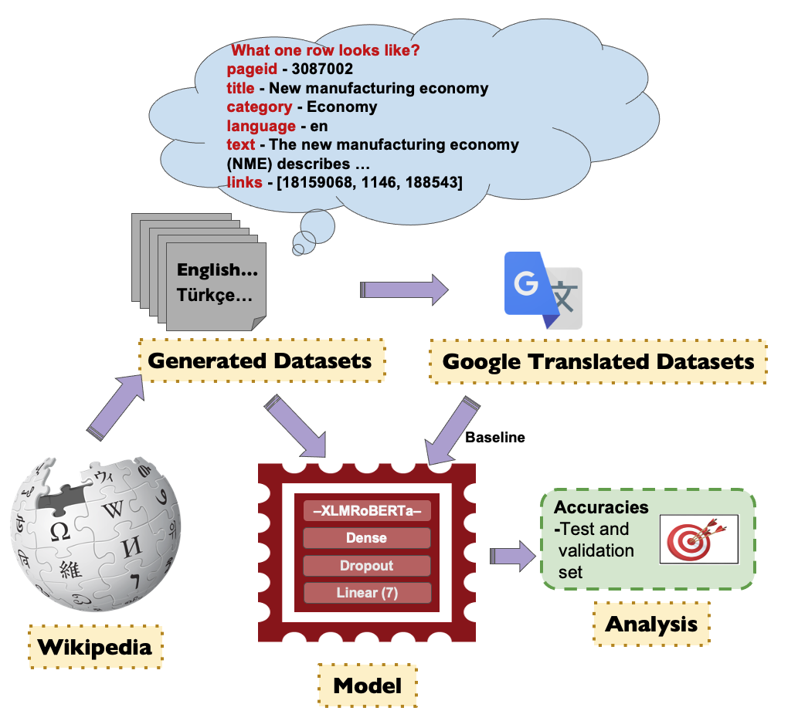
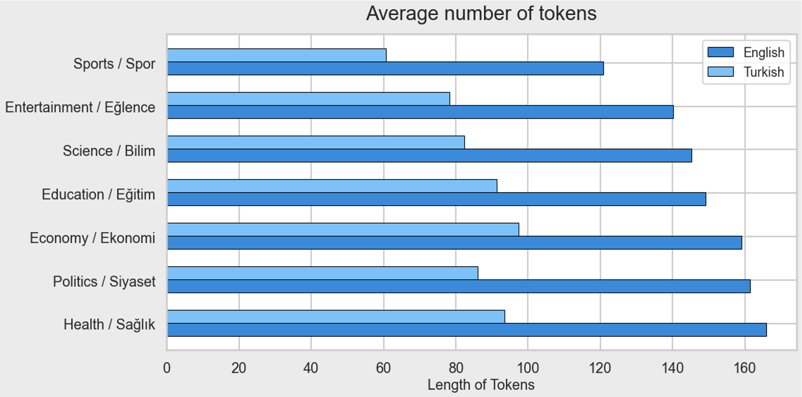
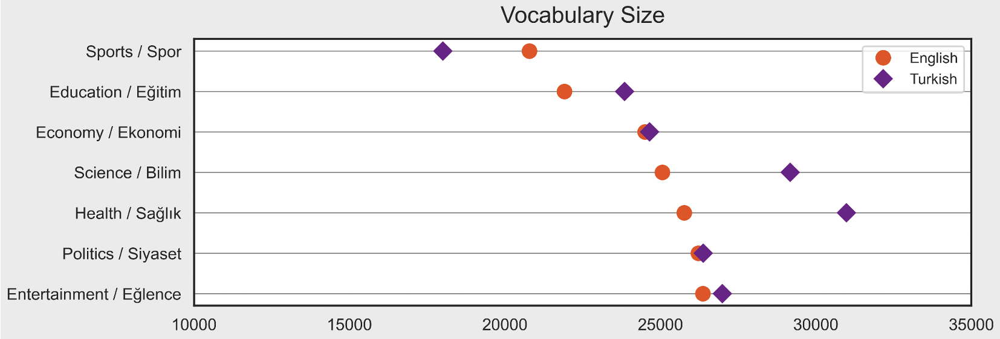
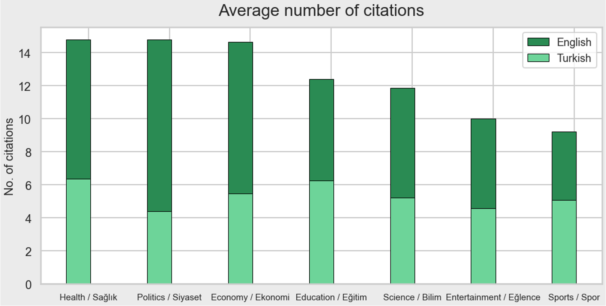
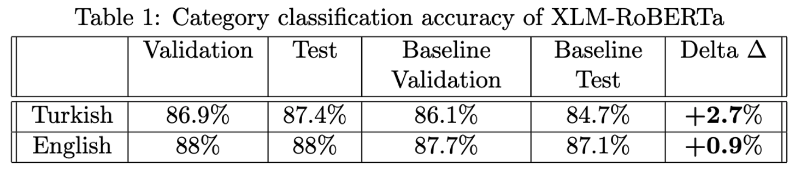

## WikiMuTo: Multilingual Topic Classification using self-generated Wikipedia dataset

This is a course project for CSCI-544 Applied Natural Language Processing, University of
Southern California.

### Motivation
Despite significant progress made in the field of Natural Language Processing in recent years,
multilingual tasks and datasets have not gained enough attention. In contrast to English,
many other languages lack reliable benchmarks. In this project, we focus on extracting a
rich dataset from Wikipedia in multiple languages, specifically Turkish. This dataset can
be used for variety of downstream tasks to fine-tune the pretrained state of the art
natural language models. Here, we test the richness of the dataset by performing a category
classification task on the summaries scrapped from wikipedia in both English and Turkish.

### Pipeline

#### Scraping the wikipedia
We use the Python’s [wikipediaAPI][python-wikipediaAPI] package to scrape wikipedia in multiple
languages.The package offers a function to find the pages and subcategories that belong to a
given category. However, given a category there are only limited number of pages on Wikipedia.
So, in order to scrape more pages, we performed breadth-first search using queues. We created
a queue and initialized with a category such as ‘Education’ or ‘Politics’. Then, while scraping
for this category, we push the subcategories found into the queue and we append the datasets with
the pages found. We continued this process until we have enough number of pages which we defined
in the beginning of the code.

#### Translating the datasets
We constructed a translated English and a translated Turkish dataset in which every Turkish
article in the original Turkish dataset is translated to english and every english article
in the original english dataset is translated to Turkish. We used Google Translator API -
[googletrans][googletrans] to translate the text. This dataset is then used in experiments
to evaluate and compare with our dataset.

##### Category classification
We used the pre-trained model [XLM-RoBERTa][XLM-RoBERTa], for this task. For the model, we
added a classification head and used the AdamW optimizer. The dataset had 7000 data points,
of which 80% were used for training, 10% for validation and 10% for testing. Finally, we used
accuracy as the metric as it is a balanced dataset.

### Results
We have created English and Turkish datasets using the pipeline on the left. In our datasets, we
have 7 categories and 1000 docs in each category. Plots below display some further statistics
about the datasets.  

Figure below shows the vocabulary size in each language by subject. It is interesting to observe
that while number of tokes in Turkish dataset is significantly less than English dataset, vocabulary
sizes are comparable. This indicates that our Turkish dataset is qualitatively rich.  

Finally, our last figure shows the distribution of the number of references, suggesting that this
dataset could be further utilized in some other downstream tasks such as citation recommendation systems.  

#### Category classification results
Classification results show that original data outperformed the translated data (baseline), validating the richness of proposed dataset.  

[python-wikipediaAPI]: https://pypi.org/project/Wikipedia-API/
[googletrans]: https://pypi.org/project/googletrans/
[XLM-RoBERTa]: https://arxiv.org/pdf/1911.02116.pdf
